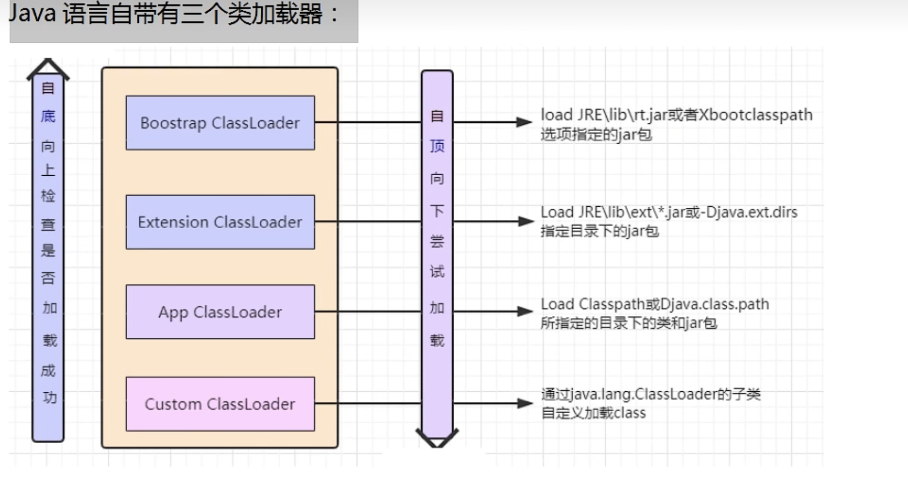
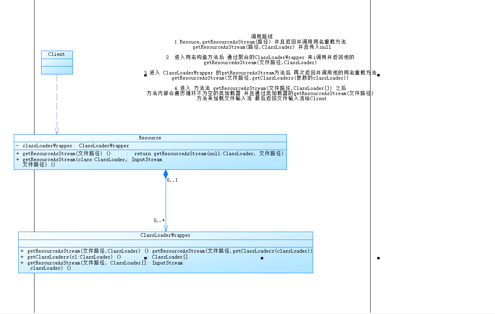
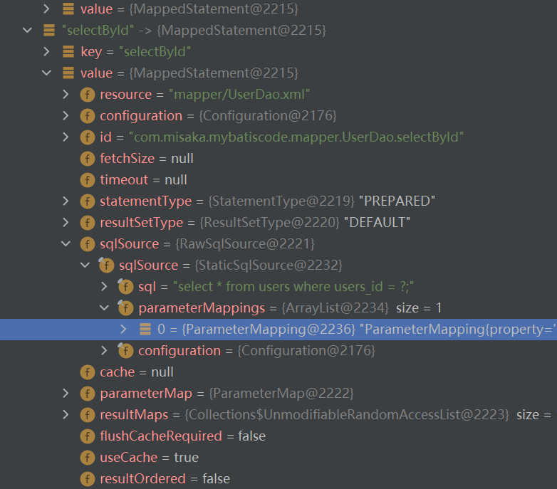
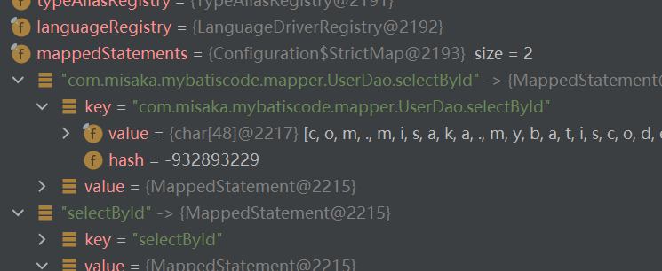
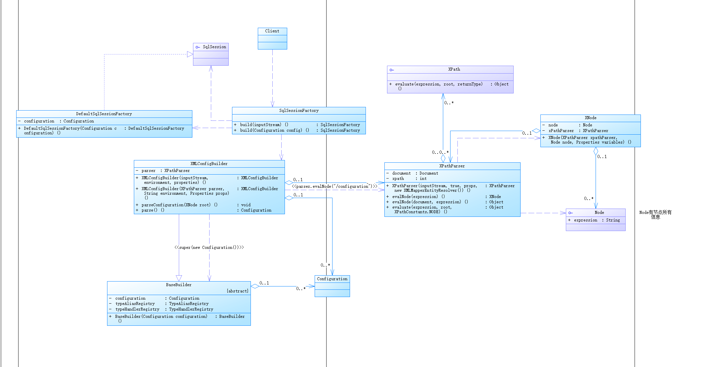
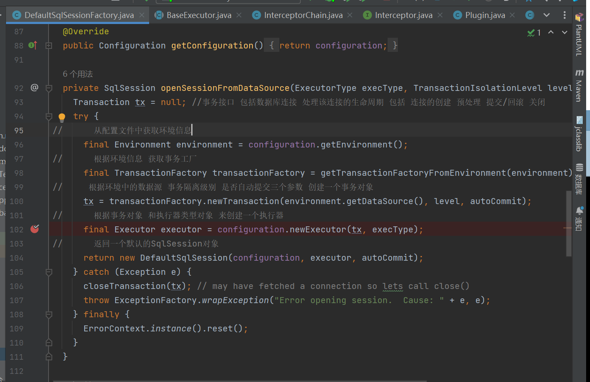
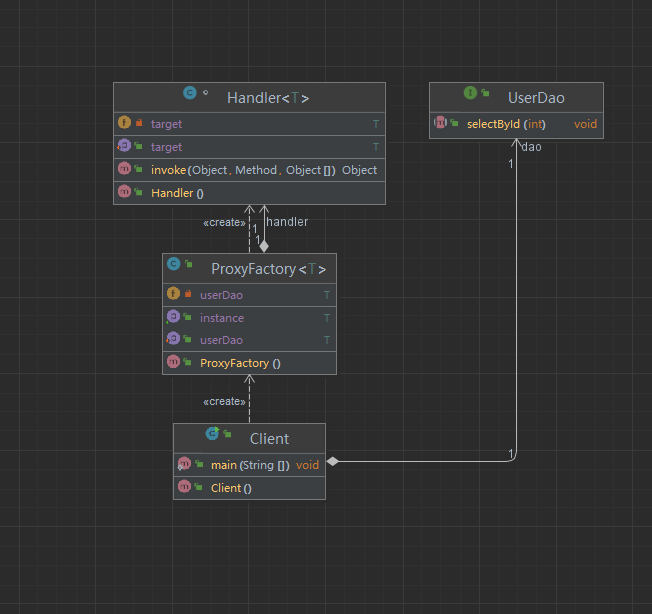
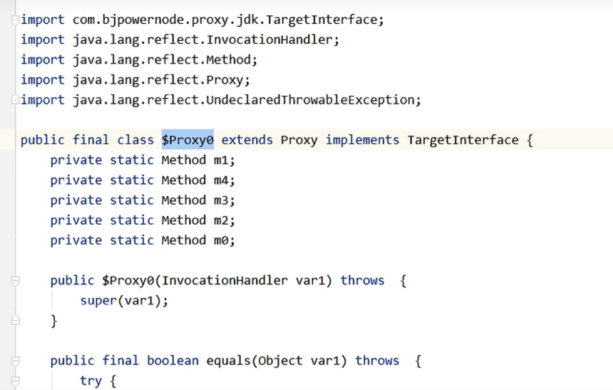
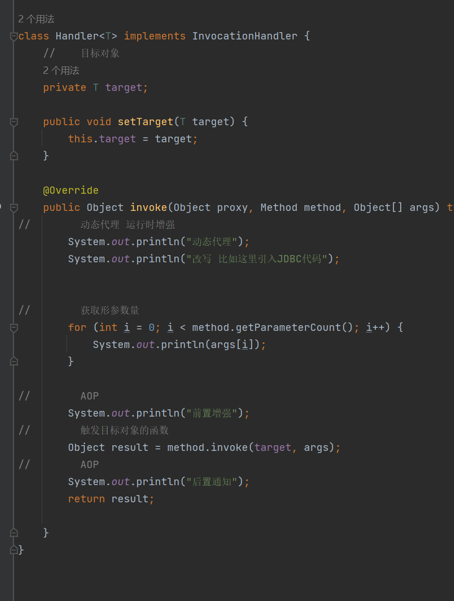

# 源码分析原则
1 寻找入口
2 断点追踪
3 先粗后细
4 精略结合
5 猜想验证

# SQL框架 mybatis 源码分析
 - 类加载器
   - ClassLoader的作用就是将class文件加载到Jvm中 程序就可以正确运行了 但是jvm启动的时候不会一次性加载所有的class文件
   - 而是需要动态加载 如果一次加载那么多jar包和class 那么内存消耗极大
   - Java自带三个加载器 SystemClassLoader[ApplicationClassLoader] ExtraClassLoader BootStrapClassLoader 并且类加载器的选择是通过双亲委派机制 从上倒下加载
   - 

# 分析
 - 第一步读取配置
    //        第一步 读取mybatis文件
    //        通过classLoader来读取文件 并且返回一个输入流
    //        InputStream inputStream = Resources.getResourceAsStream("mybatis-config.xml");
    //        其实就是 ClassLoaderWrapper类的getResourceAsStream()方法的下面一行代码
    //        InputStream returnValue = cl.getResourceAsStream(resource);
    //       就是通过classLoader来加载一个流 并且返回一个输入流
    InputStream inputStream = Thread.currentThread().getContextClassLoader().getResourceAsStream("mybatis-config.xml");
   - 调用对象路线
   - 
     1 Resouce.getResourceAsStream(路径) 并且返回并调用同名重载方法 getResourceAsStream(路径,ClassLoader) 并且传入null

     2  进入同名构造方法后 通过聚合的ClassLoaderWrapper 来调用并返回该实例的方法 getResourceAsStream(文件路径,ClassLoader)
     
     3 进入 ClassLoaderWrapper 的getResourceAsStream方法后 再次返回并调用他的同名重载方法 getResourceAsStream(文件路径,getClassLoaders(参数的classLoader))
     
     4 进入 方法法 getResourceAsStream(文件路径,ClassLoader[]) 之后 方法内部会遍历循环不为空的类加载器 并且通过类加载器的getResourceAsStream(文件路径) 方法来加载文件输入流 最后返回文件输入流给Client
   - Uml
     - 

 - 第二步 初始化工厂 SqlSessionFactory 返回 SqlSession
 - 
 - 
         /*
           * 整个调用流程
           *  1 SqlSessionFactory :  new SqlSessionFactoryBuilder().build(inputStream)
           *   2 进入Build方法 执行XMLConfigBuilder parser = new XMLConfigBuilder(inputStream, environment, properties);
           *   3 进入 XMLConfigBuilder的构造函数 调用new XPathParser(inputStream, true, props, new XMLMapperEntityResolver())
           *       4 生成XPathParser对象 TODO 内部包含document对象 内容就是Xml的解析结果 里面执行了  commonConstructor(validation, variables, entityResolver);负责成员变量赋值 this.document = createDocument(new InputSource(inputStream));读取Xml文件
           *     5 调用this(刚刚生成的XPathParser对象, environment, props);[TODO this()就是XMLConfigBuilder的构造函数]
           *       6 super(new Configuration()); 调用XMLConfigBuilder的父类BaseBuilder的构造函数 并且进行了成员赋值 将Configuration赋值到了成员变量中 这样子类也可以访问 并且new Configuration()中进行了别名列表初始化 数据结构对应 等等操作 Configuration对象就是Mybatis的核心配置类
           *       7 将参数中的XpathParser对象赋值到成员变量中
           *   8 XMLConfigBuilder的构造函数结束 并且生成了一个实例对象parser
           *   9 调用XMLConfigBuilder的实例对象parser的方法parse() 内部会判断是否已经加载过 如果加载过那么就报错
           *     1 在parse方法中调用了成员方法 parseConfiguration(parser.evalNode("/configuration"))
           *       2 进入XpathParser对象的evalNode方法 内部执行了return evalNode(document, expression);参数为document即xml解析结果 expression即传入的"/configuration" 返回值为XNode
           *          3 evalNode(document,expression)方法内部执行了Node node = (Node) evaluate(expression, root, XPathConstants.NODE);
           *             4 执行XpathParser的成员方法evaluate(expression, root, XPathConstants.NODE) 参数expression是"/configuration" root是document对象
           *                5  XpathParser的成员方法evaluate内部执行了 jdk方法 return xpath.evaluate(expression, root, returnType); 返回一个Object
           *          6 Node node = (Node) evaluate(expression, root, XPathConstants.NODE);执行结束 并且将evaluate返回值Object转型为Node类型 [TODO Node类型 是JDK提供了用于标志Xml文档节点的类]
           *          7 判断Node是否为空 不为空执行   return new XNode(this, node, variables);  TODO 参数(this就是XpathParser node就是生成node节点这里是configuration)   XNode对象 是Mybatis封装的对象 代表Xml节点的一个对象
           *             8 进入XNode构造函数进行成员赋值将 XPathParser Node[configuration] 对象通过参数聚合到类中
           *             9 XNode构造函数执行其余初始化this.name = node.getNodeName(); //configuration
                           这两个函数 都是在解析node 比如获取子节点getChildNodes 获取NodeList
                           this.attributes = parseAttributes(node);
                           this.body = parseBody(node);
                 1 至此parseConfiguration(parser.evalNode("/configuration"));的参数evalNode函数结束 并且返回了一个XNode对象 并且该对象包含了XpathParser(里面有document属性) 并且还有Node对象(包含对应的节点信息)
           *     2 调用parseConfiguration((root.evalNode("properties")) 参数 root就是XNode对象
           *        3 内部通过XNode对象调用该对象的方法evalNode(expression) 并且传入其他节点的名字例如 properties
           *           4 XNode.evalNode内部调用的是 他聚合的xpathParser对象的evalNode方法 return xpathParser.evalNode(node, expression); 并且传入了 node属性[就是刚才聚合的configuration的Node对象] 和外部传入的expression这里是properties
           *             5 然后再次执行 Node node = (Node) evaluate(expression, root, XPathConstants.NODE); 获取对应的Node节点 这里是获取的properties的节点
           *             6 执行 return new XNode(this, node, variables); 进入XNode构造函数进行成员赋值将 XPathParser Node[properties] 对象通过参数聚合到类中
           *     7 至此parseConfiguration(root.evalNode("properties"));的参数evalNode函数结束
           *     8 继续重复上述操作 直到parseConfiguration()函数结束
           *   9 最后SqlSessionFactory的build方法 的内部操作return build(parser.parse())的参数部分结束 并且得到了parser.parse()参数返回的Configuration对象
           *     1 SqlSessionFactory调用build(parser.parse()) 的build(Configuration)方法 内部又调用new DefaultSqlSessionFactory(config)
           *       2  DefaultSqlSessionFactory(config)构造函数 内部执行了赋值操作 this.configuration = configuration; 并且他实现了SqlSession接口 所以可以返回他
           *  1 返回SqlSession实现类  DefaultSqlSessionFactory 也就是return build(parser.parse());
           *
           * */
 - configuration 一部分内容
 -  
 - Uml类图
 - 
 - 总结
   - Mybatis解析配置文件的目的就是为了获取Configuration对象 
   - Configuration对象可以理解是mybatis的xml配置文件在程序中的化身 是mybatis重要的对象 里面封装了Mybatis的所有配置信息
   - XpathParser对象内部包含的document属性就是XML解析的结果
   - 
   

 - 第三步 打开SqlSession工厂 opensession   SqlSession sqlSession = factory.openSession();
   - 从Configuration中获取环境信息
   - 根据环境信息获取事务工厂对象
   - 根据环境信息创建一个事务对象
   - 根据事务和Configuration对象创建一个Executor对象
   - 根据Configuration和Executor对象 创建一个DefaultSqlSession对象
   - 

 - 第四步获取代理对象 通过   mapperProxyFactory.newInstance(sqlSession);方法来实现动态代理
 - 这个UserDao是一个 return mapperProxyFactory.newInstance(sqlSession);这方法返回的动态代理对象
   UserDao userDao = sqlSession.getMapper(UserDao.class);
    - 代理 具体实现 [MapperProxyFactory]类中
                -   protected T newInstance(MapperProxy<T> mapperProxy) {
                            //    JDK动态代理                    对应的mapper接口的类加载器 比如UserDao xxDao        class数组            聚合了SqlSession mapperInterface methodCache的MapperProxy
                            //    proxy的使用 newProxyInstance(被代理类的类加载器, 被代理类的类实现的接口列表Class.getInterfaces() ,invoke函数可以是lambda表达式[或者是一个实现了InvocationHandler接口的类])
                            //    invoke的使用   public Object invoke(Object proxy, Method method, Object[] args)
                            //                  动态代理机制
                            /*
                            * 源对象 UserDao
                            * 动态代理对象 newProxyInstance函数的返回值 暂定为 UserProxy
                            * newProxyInstance(UserDao.class.getClassLoader(),UserDao.class.getInterfaces(),invoke())
                            * UserProxy在创建后 会从object转型为目标对象的数据类型
                            * 外部使用代理对象时 会 先触发 动态代理对象的invoke函数 然后才是源对象的对应函数
                            * */
                            //    转型
                        return (T) Proxy.newProxyInstance(mapperInterface.getClassLoader(), new Class[] { mapperInterface }, mapperProxy);
                }
    - [代理模式] 
    - 静态代理和JDK动态代理的区别 静态代理无法为多种数据类型服务 A实现B A可以作为B的代理对象使用 但是这时候如果又来了C需要代理 那么就要重写代理对象继承C很麻烦
    - 动态代理通过JDK直接创建一个代理对象并且继承目标对象 在JVM内存中 所以程序员不用关心 数据类型 只用提供目标对象 JDK自动生成对应数据类型的代理对象
    - 代理模式主要是对目标对象[即被代理对象] 的增强  扩展 甚至改写 mybatis就是用到了改写
      - 为什么需要代理模式?
        - 因为一个良好的设计 不应该轻易的修改 应该准寻OCP原则 即对扩展开放 对修改关闭 而代理模式就为了扩展而存在的 不用修改原本的代码 来实现新代码
    - UML和代码[OCP_Proxy]仿照
      - 
    - 使用场景 aop 权限控制 服务监控 缓存 日志 限流 事务 拦截过滤
      - 静态代理就是自己手写代理类 Client -Request-> Proxy --> BeProxied 
    - 代理对象创建出来的样子
      - 
    - [AOP的实现]
      - 
 - 第五步 通过代理对象 来实现CRUD mybatis 通过动态代理 来改写方法内部实现 例如改为insert select对应的代码 动态代理也是AOP思想基本原理
 -       
 - /*
        * 通过代理对象 来进行查询
        * 底层
        * 1 因为是动态代理 所以通过调用MapperProxy的invoke方法 来执行cachedInvoker(method).invoke(proxy, method, args, sqlSession);
        * 2 在 cachedInvoker 内部 通过new MapperMethod(mapperInterface, method, sqlSession.getConfiguration()) 创建了一个MapperMethod对象
        * 3 在 MapperMethod的构造函数中 具体有两件事 一个是初始化SQL操作 第二初始化方法签名
        *   - 1  通过configuration.getMappedStatement(statementId) 获取MapperStatement对象这个对象包含了Mapper在xml声明的所有信息 并且这个也是在XMLConfigBuilder中 通过parseConfiguration方法来初始化的 【TODO statementId:包名+接口名+方法名组成的字符串】
        *         然后创建通过MapperStatement的属性 获取到了SQL操作的类型[SELECT or ..] 和 SQL的id [包名+接口名+方法名]
        *     2  方法签名主要是通过接口方法的信息 将一个方法作为一个对象的形式存储 MethodSignature对象中主要包含返回值信息 参数列表信息
        * 4 在获取到了MapperMethod对象后 里面就包含了 command[SQL操作信息] 和方法签名信息
        * 5 通过 new PlainMethodInvoker(MapperMethod mapperMethod) 创建了一个PlainMethodInvoker对象 并且传入了MapperMethod
        * 6 调用PlainMethodInvoker的invoke方法 里面执行了  return mapperMethod.execute(sqlSession, args);
        * 7 mapperMethod.execute(sqlSession, args)函数内部主要是通过
        *   - 判读操作类型
        *   - 判断返回类型
        *   - 通过 Object param = method.convertArgsToSqlCommandParam(args); 绑定参数 将参数转换为 SQL 命令参数
        *   - 执行查询 result = sqlSession.selectOne(command.getName(), param);
        *      参数  command.getName()
                         *传入SQL的id[其实在configuration中 有一个属性叫做MapperStatements[底层是一个哈希表 key是包名+接口名+方法名组成的字符串] 然后SqlSession[DefalutSqlSession]中聚合了Configuration 我们就可以通过SQL id 就是这里command属性的name属性
                          来获取MapperStatement对象 然后通过这个对象 获取对应的SqlSource属性 也就是SQL语句 还有其他所有关于Mapper的信息
                    param
                          * 外部传入参数的列表 或者是一个参数 可以是HashMap 也可以是一个值 刚才通过convertArgsToSqlCommandParam函数获取的返回值
            - selectOne中通过Executor接口的实现类[装饰器模式]来执行query方法 并且最后通过BaseExecutor对象来执行了 queryFromDatabase 方法
         -8 [JDBC部分]           
            - 在  queryFromDatabase 中又调用了 doQuery 方法 这个方法内部 创建了 preStatement对象 然后通过StatementHandler.query方法 调用了
            -  PreparedStatement ps = (PreparedStatement) statement;
            -         执行
                ps.execute();
       */

