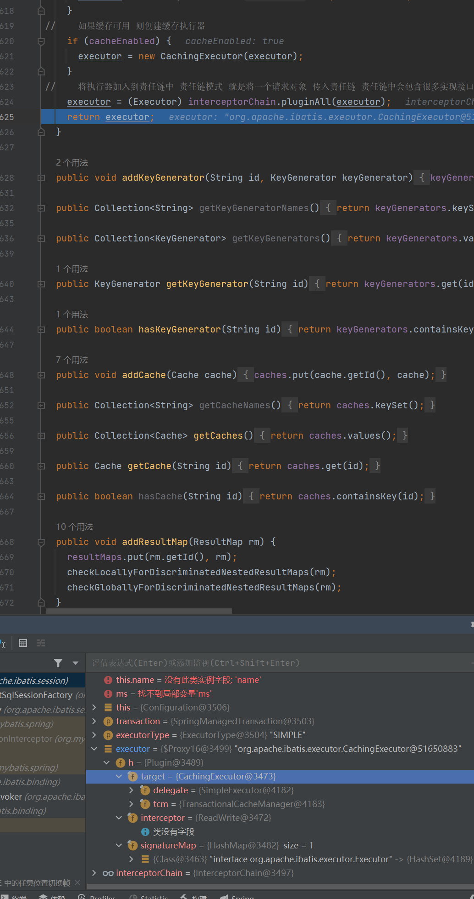
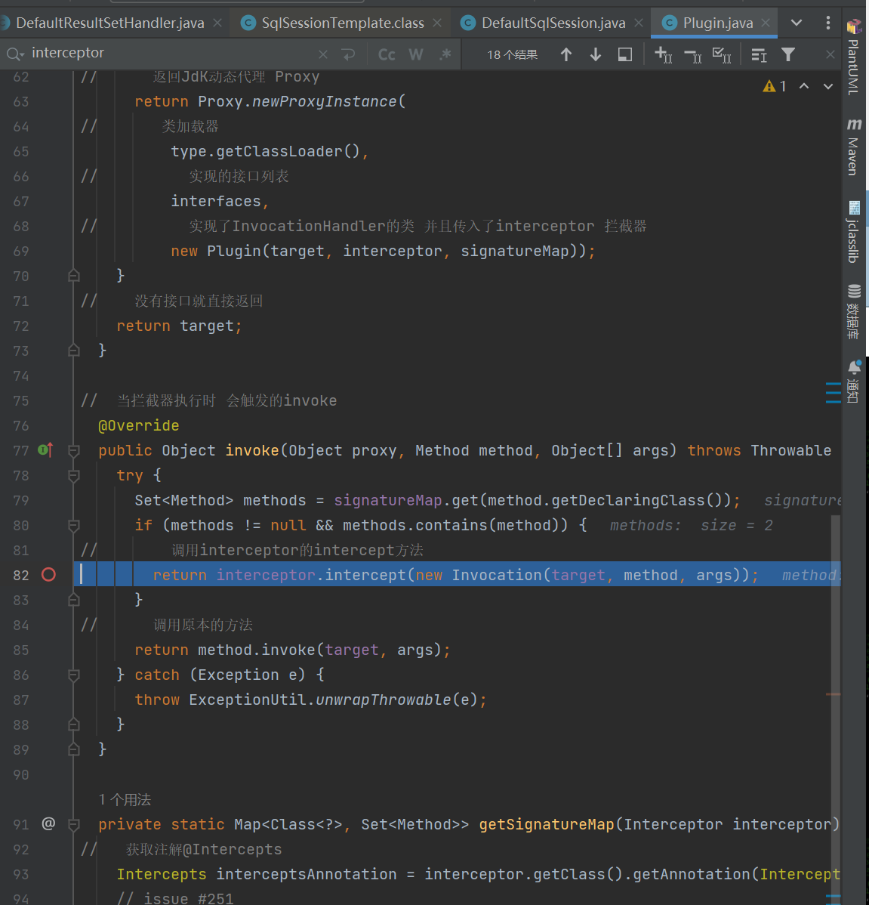

# 源码分析原则
1 寻找入口
2 断点追踪
3 先粗后细
4 精略结合
5 猜想验证

# SQL框架 mybatis 源码分析
 - 类加载器
   - ClassLoader的作用就是将class文件加载到Jvm中 程序就可以正确运行了 但是jvm启动的时候不会一次性加载所有的class文件
   - 而是需要动态加载 如果一次加载那么多jar包和class 那么内存消耗极大
   - Java自带三个加载器 SystemClassLoader[ApplicationClassLoader] ExtraClassLoader BootStrapClassLoader 并且类加载器的选择是通过双亲委派机制 从上倒下加载
   - 


# 分析
 - 第一步读取配置
    //        第一步 读取mybatis文件
    //        通过classLoader来读取文件 并且返回一个输入流
    //        InputStream inputStream = Resources.getResourceAsStream("mybatis-config.xml");
    //        其实就是 ClassLoaderWrapper类的getResourceAsStream()方法的下面一行代码
    //        InputStream returnValue = cl.getResourceAsStream(resource);
    //       就是通过classLoader来加载一个流 并且返回一个输入流
    InputStream inputStream = Thread.currentThread().getContextClassLoader().getResourceAsStream("mybatis-config.xml");
   - 调用对象路线
   - 
     1 Resouce.getResourceAsStream(路径) 并且返回并调用同名重载方法 getResourceAsStream(路径,ClassLoader) 并且传入null

     2  进入同名构造方法后 通过聚合的ClassLoaderWrapper 来调用并返回该实例的方法 getResourceAsStream(文件路径,ClassLoader)
     
     3 进入 ClassLoaderWrapper 的getResourceAsStream方法后 再次返回并调用他的同名重载方法 getResourceAsStream(文件路径,getClassLoaders(参数的classLoader))
     
     4 进入 方法法 getResourceAsStream(文件路径,ClassLoader[]) 之后 方法内部会遍历循环不为空的类加载器 并且通过类加载器的getResourceAsStream(文件路径) 方法来加载文件输入流 最后返回文件输入流给Client
   - Uml
     - 


 - 第二步 初始化工厂 SqlSessionFactory 返回 SqlSession
 - 
 - 
  /*
    * 整个调用流程
    *  1 SqlSessionFactory :  new SqlSessionFactoryBuilder().build(inputStream)
    *   2 进入Build方法 执行XMLConfigBuilder parser = new XMLConfigBuilder(inputStream, environment, properties);
    *   3 进入 XMLConfigBuilder的构造函数 调用new XPathParser(inputStream, true, props, new XMLMapperEntityResolver())
    *       4 生成XPathParser对象 TODO 内部包含document对象 内容就是Xml的解析结果 里面执行了  commonConstructor(validation, variables, entityResolver);负责成员变量赋值 this.document = createDocument(new InputSource(inputStream));读取Xml文件
    *     5 调用this(刚刚生成的XPathParser对象, environment, props);[TODO this()就是XMLConfigBuilder的构造函数]
    *       6 super(new Configuration()); 调用XMLConfigBuilder的父类BaseBuilder的构造函数 并且进行了成员赋值 将Configuration赋值到了成员变量中 这样子类也可以访问 并且new Configuration()中进行了别名列表初始化 数据结构对应 等等操作 Configuration对象就是Mybatis的核心配置类
    *       7 将参数中的XpathParser对象赋值到成员变量中
    *   8 XMLConfigBuilder的构造函数结束 并且生成了一个实例对象parser
    *   9 调用XMLConfigBuilder的实例对象parser的方法parse() 内部会判断是否已经加载过 如果加载过那么就报错
    *     1 在parse方法中调用了成员方法 parseConfiguration(parser.evalNode("/configuration"))
    *       2 进入XpathParser对象的evalNode方法 内部执行了return evalNode(document, expression);参数为document即xml解析结果 expression即传入的"/configuration" 返回值为XNode
    *          3 evalNode(document,expression)方法内部执行了Node node = (Node) evaluate(expression, root, XPathConstants.NODE);
    *             4 执行XpathParser的成员方法evaluate(expression, root, XPathConstants.NODE) 参数expression是"/configuration" root是document对象
    *                5  XpathParser的成员方法evaluate内部执行了 jdk方法 return xpath.evaluate(expression, root, returnType); 返回一个Object
    *          6 Node node = (Node) evaluate(expression, root, XPathConstants.NODE);执行结束 并且将evaluate返回值Object转型为Node类型 [TODO Node类型 是JDK提供了用于标志Xml文档节点的类]
    *          7 判断Node是否为空 不为空执行   return new XNode(this, node, variables);  TODO 参数(this就是XpathParser node就是生成node节点这里是configuration)   XNode对象 是Mybatis封装的对象 代表Xml节点的一个对象
    *             8 进入XNode构造函数进行成员赋值将 XPathParser Node[configuration] 对象通过参数聚合到类中
    *             9 XNode构造函数执行其余初始化this.name = node.getNodeName(); //configuration
                    这两个函数 都是在解析node 比如获取子节点getChildNodes 获取NodeList
                    this.attributes = parseAttributes(node);
                    this.body = parseBody(node);
          1 至此parseConfiguration(parser.evalNode("/configuration"));的参数evalNode函数结束 并且返回了一个XNode对象 并且该对象包含了XpathParser(里面有document属性) 并且还有Node对象(包含对应的节点信息)
    *     2 调用parseConfiguration((root.evalNode("properties")) 参数 root就是XNode对象
    *        3 内部通过XNode对象调用该对象的方法evalNode(expression) 并且传入其他节点的名字例如 properties
    *           4 XNode.evalNode内部调用的是 他聚合的xpathParser对象的evalNode方法 return xpathParser.evalNode(node, expression); 并且传入了 node属性[就是刚才聚合的configuration的Node对象] 和外部传入的expression这里是properties
    *             5 然后再次执行 Node node = (Node) evaluate(expression, root, XPathConstants.NODE); 获取对应的Node节点 这里是获取的properties的节点
    *             6 执行 return new XNode(this, node, variables); 进入XNode构造函数进行成员赋值将 XPathParser Node[properties] 对象通过参数聚合到类中
    *     7 至此parseConfiguration(root.evalNode("properties"));的参数evalNode函数结束
    *     8 继续重复上述操作 直到parseConfiguration()函数结束
    *   9 最后SqlSessionFactory的build方法 的内部操作return build(parser.parse())的参数部分结束 并且得到了parser.parse()参数返回的Configuration对象
    *     1 SqlSessionFactory调用build(parser.parse()) 的build(Configuration)方法 内部又调用new DefaultSqlSessionFactory(config)
    *       2  DefaultSqlSessionFactory(config)构造函数 内部执行了赋值操作 this.configuration = configuration; 并且他实现了SqlSession接口 所以可以返回他
    *  1 返回SqlSession实现类  DefaultSqlSessionFactory 也就是return build(parser.parse());
    *
    * */
 - configuration 一部分内容
 -  
 - Uml类图
 - 
 - 总结
   - Mybatis解析配置文件的目的就是为了获取Configuration对象 
   - Configuration对象可以理解是mybatis的xml配置文件在程序中的化身 是mybatis重要的对象 里面封装了Mybatis的所有配置信息
   - XpathParser对象内部包含的document属性就是XML解析的结果
   - 
   

 - 第三步 打开SqlSession工厂 opensession   SqlSession sqlSession = factory.openSession();
   - 从Configuration中获取环境信息
   - 根据环境信息获取事务工厂对象
   - 根据环境信息创建一个事务对象
   - 根据事务和Configuration对象创建一个Executor对象
   - 根据Configuration和Executor对象 创建一个DefaultSqlSession对象
   - 

 - 第四步获取代理对象 通过   mapperProxyFactory.newInstance(sqlSession);方法来实现动态代理
 - 这个UserDao是一个 return mapperProxyFactory.newInstance(sqlSession);这方法返回的动态代理对象
   UserDao userDao = sqlSession.getMapper(UserDao.class);
    - 代理 具体实现 [MapperProxyFactory]类中
                -   protected T newInstance(MapperProxy<T> mapperProxy) {
                            //    JDK动态代理                    对应的mapper接口的类加载器 比如UserDao xxDao        class数组            聚合了SqlSession mapperInterface methodCache的MapperProxy
                            //    proxy的使用 newProxyInstance(被代理类的类加载器, 被代理类的类实现的接口列表Class.getInterfaces() ,invoke函数可以是lambda表达式[或者是一个实现了InvocationHandler接口的类])
                            //    invoke的使用   public Object invoke(Object proxy, Method method, Object[] args)
                            //                  动态代理机制
                            /*
                            * 源对象 UserDao
                            * 动态代理对象 newProxyInstance函数的返回值 暂定为 UserProxy
                            * newProxyInstance(UserDao.class.getClassLoader(),UserDao.class.getInterfaces(),invoke())
                            * UserProxy在创建后 会从object转型为目标对象的数据类型
                            * 外部使用代理对象时 会 先触发 动态代理对象的invoke函数 然后才是源对象的对应函数
                            * */
                            //    转型
                        return (T) Proxy.newProxyInstance(mapperInterface.getClassLoader(), new Class[] { mapperInterface }, mapperProxy);
                }
    - [代理模式] 
    - 静态代理和JDK动态代理的区别 静态代理无法为多种数据类型服务 A实现B A可以作为B的代理对象使用 但是这时候如果又来了C需要代理 那么就要重写代理对象继承C很麻烦
    - 动态代理通过JDK直接创建一个代理对象并且继承目标对象 在JVM内存中 所以程序员不用关心 数据类型 只用提供目标对象 JDK自动生成对应数据类型的代理对象
    - 代理模式主要是对目标对象[即被代理对象] 的增强  扩展 甚至改写 mybatis就是用到了改写
      - 为什么需要代理模式?
        - 因为一个良好的设计 不应该轻易的修改 应该准寻OCP原则 即对扩展开放 对修改关闭 而代理模式就为了扩展而存在的 不用修改原本的代码 来实现新代码
    - UML和代码[OCP_Proxy]仿照
      - 
    - 使用场景 aop 权限控制 服务监控 缓存 日志 限流 事务 拦截过滤
      - 静态代理就是自己手写代理类 Client -Request-> Proxy --> BeProxied 
    - 代理对象创建出来的样子
      - 
    - [AOP的实现]
      - 
 - 第五步 通过代理对象 来实现CRUD mybatis 通过动态代理 来改写方法内部实现 例如改为insert select对应的代码 动态代理也是AOP思想基本原理
 -       
 - /*
        * 通过代理对象 来进行查询
        * 底层
        * 1 因为是动态代理 所以通过调用MapperProxy的invoke方法 来执行cachedInvoker(method).invoke(proxy, method, args, sqlSession);
        * 2 在 cachedInvoker 内部 通过new MapperMethod(mapperInterface, method, sqlSession.getConfiguration()) 创建了一个MapperMethod对象
        * 3 在 MapperMethod的构造函数中 具体有两件事 一个是初始化SQL操作 第二初始化方法签名
        *   - 1  通过configuration.getMappedStatement(statementId) 获取MapperStatement对象这个对象包含了Mapper在xml声明的所有信息 并且这个也是在XMLConfigBuilder中 通过parseConfiguration方法来初始化的 【TODO statementId:包名+接口名+方法名组成的字符串】
        *         然后创建通过MapperStatement的属性 获取到了SQL操作的类型[SELECT or ..] 和 SQL的id [包名+接口名+方法名]
        *     2  方法签名主要是通过接口方法的信息 将一个方法作为一个对象的形式存储 MethodSignature对象中主要包含返回值信息 参数列表信息
        * 4 在获取到了MapperMethod对象后 里面就包含了 command[SQL操作信息] 和方法签名信息
        * 5 通过 new PlainMethodInvoker(MapperMethod mapperMethod) 创建了一个PlainMethodInvoker对象 并且传入了MapperMethod
        * 6 调用PlainMethodInvoker的invoke方法 里面执行了  return mapperMethod.execute(sqlSession, args);
        * 7 mapperMethod.execute(sqlSession, args)函数内部主要是通过
        *  
        *   - 判断返回类型
        *   - 通过 Object param = method.convertArgsToSqlCommandParam(args); 绑定参数 将参数转换为 SQL 命令参数
        *   - 执行查询 result = sqlSession.selectOne(command.getName(), param);
        *      参数  command.getName()
                         *传入SQL的id[其实在configuration中 有一个属性叫做MapperStatements[底层是一个哈希表 key是包名+接口名+方法名组成的字符串] 然后SqlSession[DefalutSqlSession]中聚合了Configuration 我们就可以通过SQL id 就是这里command属性的name属性
                          来获取MapperStatement对象 然后通过这个对象 获取对应的SqlSource属性 也就是SQL语句 还有其他所有关于Mapper的信息
                    param
                          * 外部传入参数的列表 或者是一个参数 可以是HashMap 也可以是一个值 刚才通过convertArgsToSqlCommandParam函数获取的返回值
            - selectOne中通过Executor接口的实现类[装饰器模式]来执行query方法 并且最后通过BaseExecutor对象来执行了 queryFromDatabase 方法
         -8 [JDBC部分]           
            - 在  queryFromDatabase 中又调用了 doQuery 方法 这个方法内部 创建了 preStatement对象 然后通过StatementHandler.query方法 调用了
            -  PreparedStatement ps = (PreparedStatement) statement;
            -         执行
                ps.execute();
       */


# Mybatis 结果赋值
主要是在DefaultResultSetHandler中的handleResultSets()处理的
# Mybatis 插件原理
/*
*
* 读写分离插件 即 查询的时候 查数据库A 修改的时候查数据库 B
* */
  //这里底层会将该类 放入职责链中 每一个Executor都会进入职责链
  /*
* //    将执行器加入到责任链中 责任链模式 就是将一个请求对象 传入责任链 责任链中会包含很多实现接口 通过next()方法连接 类似于链表数据结构 如果当前责任链实现类无法处理该请求 那么会调用next方法 获取下一个责任链 直到可以处理该请求
  executor = (Executor) interceptorChain.pluginAll(executor);
    * TODO 所以只要是使用了interceptorChain的对象 都可以进行拦截处理 因为都会在pluginAll中进行循环拦截
    *    parameterHandler = (ParameterHandler) interceptorChain.pluginAll(parameterHandler);
    *    resultSetHandler = (ResultSetHandler) interceptorChain.pluginAll(resultSetHandler);
         statementHandler = (StatementHandler) interceptorChain.pluginAll(statementHandler);
         executor = (Executor) interceptorChain.pluginAll(executor);
        *  拦截的具体实现  [target是传入的要被拦截的类例如Executor] 也就是会调用Interceptor实现类的plugin方法
        *  for (Interceptor interceptor : interceptors) {
           target = interceptor.plugin(target);
           }

    * 然后interceptorChain 里面的值是通过Configuration的parseConfiguration方法来初始化的 pluginElement(root.evalNode("plugins"));
    * 所以要在XML文件中 通过<plugin> 来进行注册
    *
*
* */

# Mybatis 插件开发
 - XML解析
   - 同样和其他的XML标签一样 也是在XMLConfigBuilder的parseConfiguration方法中进行解析和赋值
   - 具体代码 
   - pluginElement(root.evalNode("plugins"));

# 获取注解的方法 getAnnotation
Intercepts interceptsAnnotation = interceptor.getClass().[getAnnotation](Intercepts.class);

# 查询
SELECT LAST_INSERT_ID()


# 多数据源 要继承 AbstractRoutingDataSource 并且重写determineCurrentLookupKey方法
 Spring 配置
<!--    读库-->
    <bean id="read" class="com.zaxxer.hikari.HikariDataSource" destroy-method="close">
        <property name="username" value="root"></property>
        <property name="jdbcUrl" value="jdbc:mysql://localhost:3306/test"></property>
        <property name="password" value="spc652324"/>
        <property name="driverClassName" value="com.mysql.cj.jdbc.Driver"/>

    </bean>
<!--    写库-->
    <bean id="write" class="com.zaxxer.hikari.HikariDataSource" destroy-method="close">
        <property name="username" value="root"></property>
        <property name="jdbcUrl" value="jdbc:mysql://localhost:3306/test"></property>
        <property name="password" value="spc652324"/>
        <property name="driverClassName" value="com.mysql.cj.jdbc.Driver"/>

    </bean>
<!--对象 并且通过注入-->
    <bean id="dynamicDataSource" class="com.misaka.mybatiscode.util.DynamicDataSource">
        <property name="targetDataSources">
            <map>
                <entry key="READ" value-ref="read"/>
                <entry key="WRITE" value-ref="write"/>
            </map>
        </property>
    </bean>
<bean id="sqlSessionFactory" class="org.mybatis.spring.SqlSessionFactoryBean">
    <property name="dataSource" ref="dynamicDataSource"/>
    <property name="configLocation" value="classpath:mybatis-config.xml"/>
</bean>
<!--    mapper-->
    <bean class="org.mybatis.spring.mapper.MapperScannerConfigurer">
        <property name="sqlSessionFactoryBeanName" value="sqlSessionFactory"/>
        <property name="basePackage" value="com.misaka.mybatiscode.mapper"/>
    </bean>
<!--    数据源-->
    <bean id="transationManager" class="org.springframework.jdbc.datasource.DataSourceTransactionManager">
        <property name="dataSource" ref="dynamicDataSource"/>
    </bean>

# 拦截器

最后在Plugin接口中调用了interceptor的intercept方法



# Mybatis总结
 - 流程
   - Resource.getResourceAsStream('mybatis-config.xml') //////       就是通过classLoader来加载一个流 并且返回一个输入流
   - SqlSessionFactoryBuilder : 他的Builder()方法传入一个输入流 就是Resource.getResourceAsStream('mybatis-config.xml')的返回值 并且返回一个SqlSessionFactory[底层是DefaultSqlSessionFactory即 SqlSessionFactory的实现类] 返回一个SqlSessionFactoryBuilder
   - sqlSessionFactoryBuilder.openSession() 开启Session 返回一个SqlSession对象
   - SqlSession.getMapper('xxxDao.xml') : 解析Mapper 并且返回一个动态代理对象 [底层用了JDK动态代理]  xxxDao
   - 动态代理对象.CRUD() 执行
 - 重点类

BaseBuilder : XMLConfigBuilder的父类 XMLConfigBuilder通过Super(new Configuration()) 将Configuration对象聚合到BaseBuilder中
XMLConfigBuilder : 里面包含Configuration XPathParser XNode node 还有很重要的方法 parse() parseConfiguration(XNode)
XMLPathParser : 里面包含Document对象 和 Xpath对象 也就是解析XML文件的对象
XNode : Mybatis封装的Node对象
Node : JDK对象 代表XML 的一个节点
SqlSession : 用于启动SQL 并且包含Configuration
DefaultSqlSessionFactory  : 工厂模式 SqlSessionFactory的实现类 里面的openSession可以返回一个SqlSession对象
Configuration : 包含mybatis所有的配置
Document : XML解析结果对象
MapperProxyFactory : 动态代理对象工厂 用于返回一个动态代理对象 也就是 xxDao d= SqlSession.getMapper(xxDao.xml); 这里的返回值是一个动态代理杜埃县 所以这个对象每调用一次 就会触发一个相应的invoke函数
Interceptor: 拦截器接口 如果想要自定义拦截器需要实现该接口
interceptorChain : 拦截链 通过责任链模式实现的一种拦截结构 如果有对应的拦截器 那么就会循环拦截链
Executor:执行器
MapperStatement : 对Mapper的OOP封装 里面有CommandType(执行方式) SqlSource(Sql语句) 等信息
MapperStatements : 是一个HashMap <String,MapperStatement> String是包名+接口名+方法名的格式 比如执行了UserDao的select方法就是 com.misaka.UserDaoUserDaoSelect value就是这个方法对应在Mapper.xml中的Sql语句 只不过Mybatis将其封装为了MapperStatement


# Spring 源码解析
 - 配置
   - Spring使用了Gradle进行编译


# springmvc
 - 关键组件
 - DispatcherServlet
   - 是一个springmvc提供的servlet 是mvc处理请求的入口 

 - HandlerMapping
   - 根据请求的信息(url,method,header....)负责找到自定义的controller的处理请求方法
    ``` java
    public interface HandlerMapping {
      HandlerExecutionChain getHandler(HttpServletRequest request) throws Exception;
    }
    ```
   - 常见的实现类
     - RequestMappingHandlerMapping：请求映射处理器映射，用来处理@RequestMapping 定义的处理器的
   
 - HandlerExecutionChain
      - HandlerMapping#getHandler 方法会根据请求得到一个 HandlerExecutionChain 对象。
        - 改类含有三个属性
        - handler : 请求拦截器 例如Controller
        - interceptorList 存储当前请求匹配的拦截器列表
        - interceptorIndex 拦截器索引 记录当前执行到多少个了
        
 - Handler
   - 用户自定义的Controller，在 DispatcherServlet 的控制下 handler 对具体的请求进行处理。
   
 - HandlerAdapter
   - 负责对handler的方法进行调用 因为handler有多种类型 @GetMapping @RequestMapping ..... 每种handler的过程可能不一样 所以用到了适配器模式
   - 适配器暴露了一个方法 让子类实现 [ModelAndView<-HandlerAdapter#handler(req,res,handler)] 方法内部用来处理请求
     - 常见的实现类 RequestMappingHandlerAdapter

 - ModelAndView
   - 对象用于存放视图的名称 和 数据

 - ViewResolver
   - 解析视图
     - 这个接口有很多实现类，比如 jsp 的、freemarker、thymeleaf 的等，他们都有各自对应的 ViewResolver。

 - View
   - 负责通过ModelAndView的数据 来渲染页面

 - HandlerExceptionResolver
   - 处理异常解析器
     - 负责处理异常 这个接口resolveException方法 返回异常情况下对应的 ModelAndView 对象

 - HttpMessageConverter
   - Http报文转换
   - 将请求报文转为java对象 或者是将java转为响应报文
   - 在处理 @RequestBody RequestEntity @ResponseBody[java转json]、ResponseEntity
 
# springMvc处理流程
 - 1 mvc处理请求
   - 请求都会到达DispatchServlet的doDispatch方法
     - 1 初始化doDispatch
       - HandlerExecutionChain = null // 拦截链
       - WebAsyncManager asyncManager = WebAsyncUtils.getAsyncManager(request); [servlet3.0 异步处理请求 子线程处理请求]
       - ModelAndView  = null [模型视图]
       - Exception = null[异常对象]
       - multipartRequestParsed = false [用于标记请求是否为文件类型]
     - 2 解析multipart类型的请求 即文件类型请求
       - processedRequest = checkMultipart(request);
       - multipartRequestParsed =  (processedRequest != request) [如果为MultiFile请求 那么request会被转型为MultipartHttpServletRequest]
     - 3 根据请求获取HandlerExecutionChain对象
       - mapperHandler= getHandler(request)
       - 如果没有找到控制器
         - 抛出****404****异常
     - 4 根据获取的处理器 来获取对应的适配器
       - HandlerAdapter ha = getHandlerAdapter(mappedHandler.getHandler());
     - 5 调用拦截器的prehandle方法  若返回false 处理结果
       - if (!mappedHandler.applyPreHandle(processedRequest, response)) {
           return;
           }
     - 6 调用handler实际请求 获取ModelAndView对象 这里会调用Adapter的handler方法来处理 
       - mv = ha.handle(processedRequest, response, mappedHandler.getHandler());
     - 7 调用拦截器的postHandle方法
       - mappedHandler.applyPostHandle(processedRequest, response, mv);
     - 8 处理分发结果 渲染视图
       - processDispatchResult(processedRequest, response, mappedHandler, mv, dispatchException);

# 解析请求流程
 - 1 解析multipart类型请求
   - 里面先判断 解析器是否为null && 请求是否为multipart类型
     - 如果判断为multipart类型
       - return this.multipartResolver.resolveMultipart(request); [将请求转为MultipartHttpServletRequest类型]
     - 否则直接返回
       - return request 
 - 2 获取当前请求的HandlerExecutionChain对象 [  HandlerExecutionChain handler = mapping.getHandler(request);]
   - 该对象主要是包含了三个信息
     - handler 当前请求的请求处理器
     - interceptorList 当前请求的拦截器链
     - interceptorIndex 拦截器下标 
   - 其中handler的数据类型为 [HandlerMethod] [每一个RequetMapping 就会有一个HandlerMethod]
     - 里面属性就聚合了Controller 和 处理请求的Method 
     - 到时候通过Method.invoke(controller,args) 就可以调用指定的方法
   - [doDispatch里面的 mapping.getHandler(request) 解析 !!! 请求对应的handler和拦截器的方法]
     - 这里的mapping是RequestMappingHandlerMapping 然后该类并没有重写getHandler方法 
     - 所以会调用父类AbstractHandlerMapping的getHandler
     - 1  Object handler = this.getHandlerInternal(request); [获取对应的控制器]
       - 1 String lookupPath = initLookupPath(request); [初始化请求路径]
       - 2 HandlerMethod handlerMethod = lookupHandlerMethod(lookupPath, request); [通过路径和请求 匹配handler 并且返回HandlerMethod对象]
         - 1 List<T> directPathMatches = this.mappingRegistry.getMappingsByDirectPath(lookupPath); [通过路径在mapping路径集合中 直接获取对应的handler]
           - this.pathLookup.get(urlPath) [获取对应的RequestMappingInfo 对象 里面聚合了路径信息 请求类型信息 请求头信息 请求参数信息]
         - 2 如果directPathMatches !=null [说明有匹配的handler]
           - 执行 addMatchingMappings(directPathMatches, matches, request); 
           - 循环mapping集合
             - T match = getMatchingMapping(mappingItem, request);
             - 执行RequestMappingInfoHandlerMapping的getMatchingMapping方法 传入的参数[匹配的mapper 和 请求体]
               - return info.getMatchingCondition(request); [info为匹配的mapper对象 request是请求体]
                 - info.getMatchingCondition()
                 - 通过RequestMappingInfo内部聚合的信息 和 request匹配 [类型匹配 参数匹配 如果有一个没有匹配上 就会return null]
                 - 最后重新new一个RequestMappingInfo
           - 回到addMatchingMappings的循环中
             - 判断返回的值是否为null
               - 不为null 说明匹配成功
               - 执行 matches.add(new Match(match, this.mappingRegistry.getRegistrations().get(mapping)));
                 - this.mappingRegistry.getRegistrations().get(mapping) [从mapping信息表(getRegistrations)中拿到对应mapping的元数据 里面包含了例如HandleMethod对象(controller和对应的method) 还有mapping对象本身 和路径 ]
                 - new Match(match,MappingRegistration)
                 - 里面主要是做了成员变量赋值
           - 继续循环所有路径匹配成功的mapping
         - 判断matches 是否为null 
           - 如果不为空 说明有对应的handler处理该请求
             - 1 取出第一个Match对象[里面聚合了MappingRegistration(这里面有HandlerMethod对象 即聚和了该mapping对应的Controller和Method) 和 Mapping对象]
               - Match bestMatch = matches.get(0);
             - 2 判断Match的size是否大于>1
               - 说明有多个匹配
               - 根据优先级来执行1
             - 3 处理匹配请求的URL参数
               - handleMatch(bestMatch.mapping, lookupPath, request);
                 - bestMatch就是Match对象 里面包含了Mapping
                 - lookupPath 即请求的路径
                 - request 请求体
             - 4 返回MappingRegistry对象的HandlerMethod属性
               - return bestMatch.getHandlerMethod()
                 - 内部为  return this.registration.getHandlerMethod(); [Match对象聚合了MappingRegistry 并且MappingRegistry聚合了HandlerMethod]
     - 返回HandlerMethod getHandlerInternal()方法结束 继续执行getHandler()
     - 获取执行链
       - HandlerExecutionChain executionChain = getHandlerExecutionChain(handler, request);
         - 参数
           - handler 刚才匹配的控制器 类型为 HandlerMethod[包含了处理请求的Controller和Method]
           - request为请求
         - 执行
           - 1 先判断Handler的类型 是否为HandlerExecutionChain 如果是就直接转型
             - 我们这里为HandlerMethod所以 执行  new HandlerExecutionChain(handler) [并赋值给变量 chain]
           - 2 获取所有的拦截器 并且循环判断是否需要拦截 当前的请求
             - 判断 mappedInterceptor.matches(request)
               - 1 获取请求的路径 Object path = ServletRequestPathUtils.getCachedPath(request);
               - 2 判断拦截器是否含有excludePath
                 - 如果excludePath匹配成功 则return false;
               - 3 判断includePath匹配
                 - 成功返回true
               - 4 都没匹配 返回false
             - 如果上面返回true
               - chain.addInterceptor(对应的拦截器)
             - 然后这时候 HandlerExecutionChain的handler属性和interceptorList属性都已经初始化完毕
       - 返回HandlerExecutionChain对象 handler属性为HandlerMethod interceptorList为拦截器链 intercptorIndex为-1
       - 至此 doDispatch的 mappedHandler = getHandler(processedRequest); 结束 
     [mappedHandler = getHandler(processedRequest); 该方法主要是负责寻找当前请求对应的handler【HandlerMethod】 以及拦截器 并且封装为HandlerExecutionChain]
     - 2  HandlerAdapter ha = getHandlerAdapter(mappedHandler.getHandler())
       -  通过HandlerMethod对象 获取对应的Adapter来处理请求
    


